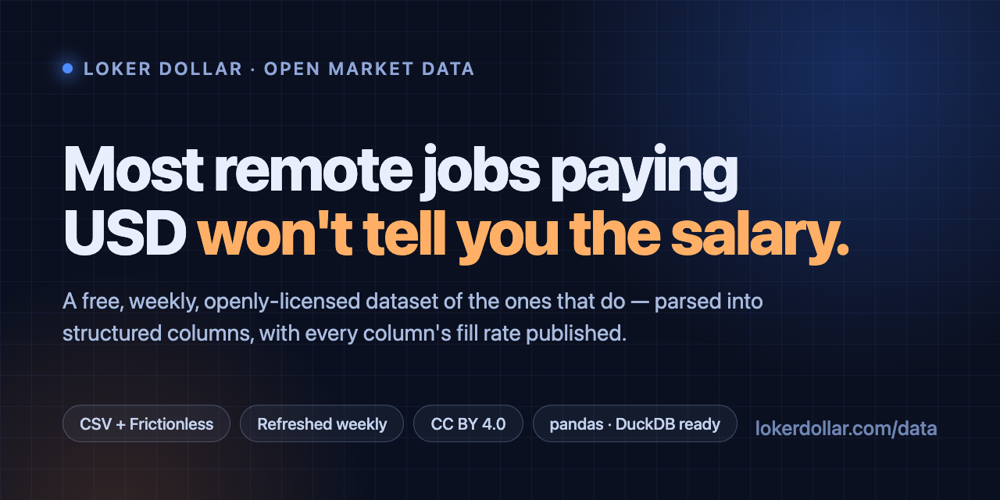

# Remote Jobs That Pay in USD — a free, weekly, open dataset




[](https://doi.org/10.5281/zenodo.22168464)


**5,398 active remote roles paying in USD, from 1,402 companies — and only 17.5% of them will tell you the salary.**

That number is the reason this repo exists. Job boards show you postings; almost
none of them let you *measure* the market. This is the measurement layer: a
weekly, openly-licensed slice of a live corpus, with each posting parsed into
structured columns — required skills, a normalised pay range, remote and
timezone fit — rather than left as prose.

Every column ships with its fill rate, below. Some of the schema is aspirational
and says so.

**[⬇️ Grab the sample CSV](data/sample-remote-jobs.csv)** · **[📈 Get the full daily dataset](https://lokerdollar.com/en/data?utm_source=github_data_teaser&utm_medium=referral&utm_campaign=market_data_2026_09)** · **[📊 Read the free market reports](https://lokerdollar.com/en/reports/roles?utm_source=github_data_teaser&utm_medium=referral&utm_campaign=market_data_2026_09)**

[](https://colab.research.google.com/github/kelvindesman/lokerdollar-market-data/blob/main/examples/quickstart.ipynb) — run the whole analysis in your browser, nothing to install.

> **Last updated: 2026-09-14.** Regenerated weekly from the live [Loker Dollar](https://lokerdollar.com/en?utm_source=github_data_teaser&utm_medium=referral&utm_campaign=market_data_2026_09) corpus. Free sample here; the full enriched dataset is paid.

---

## Try it in 30 seconds

```bash
curl -sL https://raw.githubusercontent.com/kelvindesman/lokerdollar-market-data/main/data/sample-remote-jobs.csv | head -3
```

```python
import pandas as pd

df = pd.read_csv("https://raw.githubusercontent.com/kelvindesman/lokerdollar-market-data/main/data/sample-remote-jobs.csv")
# Which remote roles pay the most, and who is hiring for them?
print(df.sort_values("pay_max", ascending=False)[["title", "company", "pay_min", "pay_max"]].head(10))
```

```sql
-- DuckDB: no download needed
SELECT title, company, pay_min, pay_max, pay_currency
FROM 'https://raw.githubusercontent.com/kelvindesman/lokerdollar-market-data/main/data/sample-remote-jobs.csv'
WHERE pay_period = 'yearly'
ORDER BY pay_max DESC
LIMIT 10;
```

Want it worked through end to end — top payers, pay distribution, the skills
that travel with the top of the range? **[Open the notebook in
Colab](https://colab.research.google.com/github/kelvindesman/lokerdollar-market-data/blob/main/examples/quickstart.ipynb)** ([source](examples/quickstart.ipynb)).

## Preview

| title | company | remote_type | pay_min | pay_max | pay_currency | pay_period |
| --- | --- | --- | --- | --- | --- | --- |
| Sr Account Director, Enterprise - 11885 | Coupa | worldwide | 195000 | 221667 | USD | yearly |
| Principal Product Manager, Directed Workf… | Zillow | worldwide | 169300 | 284700 | USD | yearly |
| Account Executive, Commercial (Pittsburgh) | Everpure | worldwide | 111500 | 167500 | USD | yearly |
| Tax Manager/Director(Remote) | Solid Rock Recruiting LLC | regional | 120000 | 170000 | USD | yearly |
| CPC Processor Customer Support- 8055 | TalentHop | worldwide | 15 | 18 | USD | hourly |

_50 rows in the current sample — every one active and salary-disclosing._

## Data dictionary

`Filled` is the share of rows in **this** sample that actually carry a value —
published so you can see what the enrichment does and does not deliver before
you build on it, rather than finding out in your own notebook.

| Column | Type | Filled | Meaning |
| --- | --- | ---: | --- |
| `id` | string | 100% | Stable internal job id |
| `title` | string | 100% | Job title as posted |
| `company` | string | 100% | Hiring company |
| `location` | string | 100% | Stated location text |
| `remote_type` | string | 100% | worldwide \| regional \| country-restricted \| hybrid |
| `job_type` | string | 100% | full-time \| part-time \| contract \| internship |
| `pay_min` | integer | 100% | Lower bound of the stated range |
| `pay_max` | integer | 100% | Upper bound of the stated range |
| `pay_currency` | string | 100% | ISO 4217 currency code |
| `pay_period` | string | 100% | yearly \| monthly \| hourly |
| `skills_required` | string | 100% | JSON array — must-have skills, extracted from the posting |
| `skills_bonus` | string | 0% | JSON array — nice-to-have skills. Not yet populated; see the Filled column. |
| `green_flags` | string | 0% | JSON array — positive signals (async, equity, visa support). Not yet populated; see the Filled column. |
| `red_flags` | string | 2% | JSON array — caution signals (unpaid trial, vague scope). Sparse; see the Filled column. |
| `indonesian_context` | string | 100% | JSON — Indonesia-fit notes (timezone overlap, hiring posture) |
| `posted_at` | string | 100% | ISO 8601 posting timestamp |

The sample omits `source_url` (the live apply link); the paid tiers include it.
Machine-readable schema: [`datapackage.json`](datapackage.json) (Frictionless Data Package).

## Headline numbers

- **5,398** active remote USD roles tracked right now
- **945** (17.5%) disclose a salary range
- **1,402** distinct hiring companies
- **5.2%** of tracked Indonesian-market roles are tech roles (n=57,987)

## Weekly trend

Week over week: **-202** active roles, salary disclosure **+0.7 pp**.

| Week of | Active roles | With salary | Disclosure rate | Companies |
| --- | ---: | ---: | ---: | ---: |
| 2026-08-31 | 5,099 | 750 | 14.7% | 1,482 |
| 2026-09-07 | 5,600 | 942 | 16.8% | 1,410 |
| 2026-09-14 | 5,398 | 945 | 17.5% | 1,402 |

Full machine-readable history: [`data/stats-history.json`](data/stats-history.json).

## 🔓 Get the full dataset

The sample is 50 rows. The complete, daily-refreshed dataset is
**every active role**, with the live apply URL and a commercial redistribution
license — for recruiters sourcing at volume, researchers who need the whole
population, and anyone building on top of it.

**→ [Download the full dataset](https://lokerdollar.com/en/data?utm_source=github_data_teaser&utm_medium=referral&utm_campaign=market_data_2026_09)**

## Cite this dataset

Attribution is the licence condition — and the fastest way to help. Paste this
wherever you publish a chart or a number from it:

```html
Source: <a href="https://lokerdollar.com/en/data">Loker Dollar Remote Job Market Data</a> (CC BY 4.0), retrieved 2026-09-14.
```

```bibtex
@dataset{lokerdollar_remote_job_market,
  title     = {Loker Dollar Remote Job Market Data --- USD roles, weekly sample},
  author    = {{Loker Dollar}},
  year      = {2026},
  publisher = {Zenodo},
  doi       = {10.5281/zenodo.22168464},
  url       = {https://lokerdollar.com/en/data},
  note      = {Version 2026-09-14. CC BY 4.0}
}
```

The DOI above is the *concept* DOI: it always resolves to the newest archived
version. Archived snapshots: <https://doi.org/10.5281/zenodo.22168464>.

GitHub's **Cite this repository** button reads [`CITATION.cff`](CITATION.cff).

Publishing something built on this? [Open a showcase issue](https://github.com/kelvindesman/lokerdollar-market-data/issues/new?template=showcase.yml)
— good analyses get linked from the reports below, which is a real inbound link
back to your work.

## Free reports built on this data

- [Role market reports (13 families)](https://lokerdollar.com/en/reports/roles?utm_source=github_data_teaser&utm_medium=referral&utm_campaign=market_data_2026_09)
- [Indonesia Quarterly Labor Market Report](https://lokerdollar.com/en/reports/indonesia-quarterly-market-report?utm_source=github_data_teaser&utm_medium=referral&utm_campaign=market_data_2026_09)
- [Global remote salary benchmark](https://lokerdollar.com/en/reports/global-remote-salary-benchmark?utm_source=github_data_teaser&utm_medium=referral&utm_campaign=market_data_2026_09)
- [Indonesian Remote Work Salary & Demand Index](https://lokerdollar.com/en/reports/indonesia-remote-salary-demand-index?utm_source=github_data_teaser&utm_medium=referral&utm_campaign=market_data_2026_09)
- [Indonesia salary benchmark](https://lokerdollar.com/en/reports/indonesia-salary-benchmark?utm_source=github_data_teaser&utm_medium=referral&utm_campaign=market_data_2026_09)
- [Indonesia hiring report: tech vs non-tech](https://lokerdollar.com/en/reports/indonesia-tech-hiring?utm_source=github_data_teaser&utm_medium=referral&utm_campaign=market_data_2026_09)
- [Remote hiring data](https://lokerdollar.com/en/remote-hiring-data?utm_source=github_data_teaser&utm_medium=referral&utm_campaign=market_data_2026_09)
- [Indonesia IT Jobs vs Global Remote (2026)](https://lokerdollar.com/en/research/indonesia-it-jobs-vs-global-remote-2026?utm_source=github_data_teaser&utm_medium=referral&utm_campaign=market_data_2026_09)
- [AI-Skill Demand: Indonesia vs Global Remote (2026)](https://lokerdollar.com/en/research/ai-skill-demand-indonesia-vs-global-2026?utm_source=github_data_teaser&utm_medium=referral&utm_campaign=market_data_2026_09)
- [Remote ≠ Remote: The Skills That Open Global Work to Indonesians (2026)](https://lokerdollar.com/en/research/remote-geo-gap-indonesia-2026?utm_source=github_data_teaser&utm_medium=referral&utm_campaign=market_data_2026_09)
- [The Compliance Layer of the AI Hiring Stack (2026)](https://lokerdollar.com/en/research/ai-hiring-stack-2026?utm_source=github_data_teaser&utm_medium=referral&utm_campaign=market_data_2026_09)

## How it's built

Postings are ingested continuously from employer sites and job feeds, normalised
into one schema, then enriched — required skills, geo fit and Indonesia-fit
notes are extracted per posting. This repo is regenerated **every week** from
the live corpus; the push refuses to run if the active-role count falls below a
sanity floor, so a broken pipeline shows up as a stale repo, never as a silently
empty dataset.

Not every schema column is enriched yet. The `Filled` column in the data
dictionary is generated from the sample itself, so it tells you what landed this
week rather than what was promised.

## License

[CC BY 4.0](https://creativecommons.org/licenses/by/4.0/) — see [`LICENSE`](LICENSE).
Reuse, remix and resell your analysis freely, **with attribution** to
[lokerdollar.com](https://lokerdollar.com/en?utm_source=github_data_teaser&utm_medium=referral&utm_campaign=market_data_2026_09).

---

*README, CSV, schema and citation file are regenerated automatically every week — do not edit by hand.*
